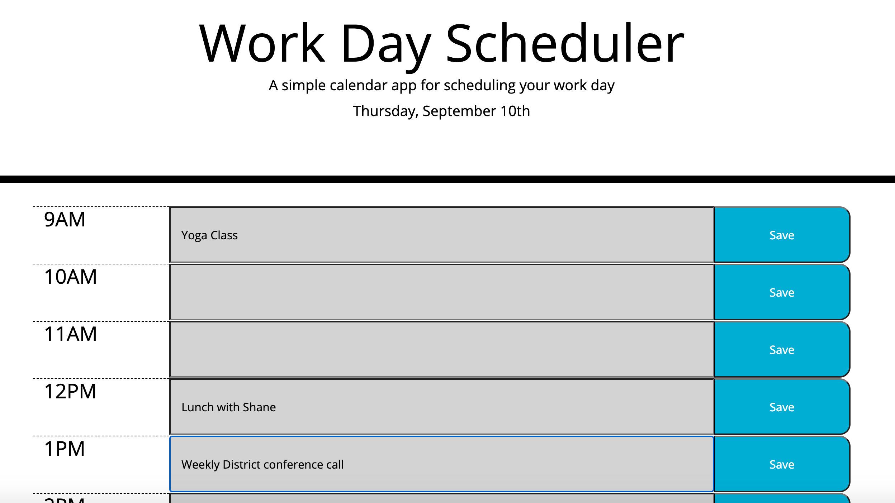

# Day Planner

</>

For this assignment, I've created a simple calendar application that allows the user to enter and save tasks/events for each business hour of the day. The day planner displays the current day at the top of the page. Each hourly time slot is color coded to indicate whether it is in the past, present, or future. The user simply enters their task/event in an hourly time slot and clicks the corresponding save button to store the task/event in the planner. 

https://jeniglar.github.io/DayPlanner/
